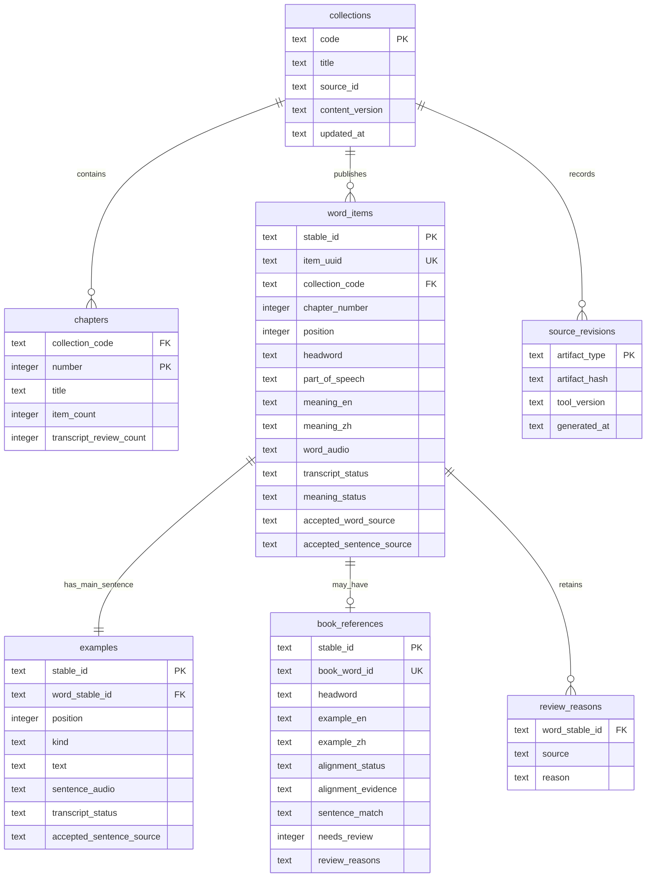

# SQLite content model

The runtime database is a read-only projection for learner requests. It is
rebuilt from preparation artifacts; it is not the source of truth for audio,
ASR, OCR, or browser learner state.

## Design goals

- Keep stable audio identity independent of mutable spelling, book numbering,
  or later editorial corrections.
- Store the learner-facing word and sentence separately so a reviewed book can
  replace one field without silently replacing the other.
- Keep book provenance and alignment evidence queryable without making OCR or
  model caches runtime dependencies.
- Keep raw review reasons available for audit while exposing only unresolved
  ASR fields in the learner-facing card.
- Leave Known, Flagged, starred-sentence, playback, and review scheduling state
  in browser LocalStorage for this local-first version.

## Relationships

## Field-source contract

`word_items.headword` and `examples.text` are accepted learner-facing values,
not necessarily raw ASR values. Their source is explicit:

| Runtime field | Use reviewed-book value when | Otherwise keep | Source column |
| --- | --- | --- | --- |
| `word_items.headword` | `alignment_status` is `matched_headword` or `matched_sentence` | selected ASR headword | `accepted_word_source` |
| `examples.text` | `sentence_match` is `exact` or `normalized` | selected ASR sentence | `accepted_sentence_source` |

The separate `book_references` row always retains the reviewed-book value,
alignment method, page provenance, and review reasons. The selected ASR
artifacts remain outside the runtime projection and are not deleted when a
book field becomes accepted. A field-level replacement therefore does not
change `stable_id`, `item_uuid`, media paths, or browser progress keys.

An item remains in the unresolved ASR count when either accepted source is
`asr`. This makes the summary and chapter counts describe remaining learner
review work instead of counting ASR reasons that a reliable book field has
already resolved.

## Runtime boundary

The Rust API reads only `var/content/content.sqlite` and copied media. It does
not read `content/book-sources/`, selected transcript files, raw ASR runs, or
model caches during a learner request. `content_version` includes the
projection-rule version so changing field-selection semantics produces a new
runtime revision even when the input artifacts are unchanged.
